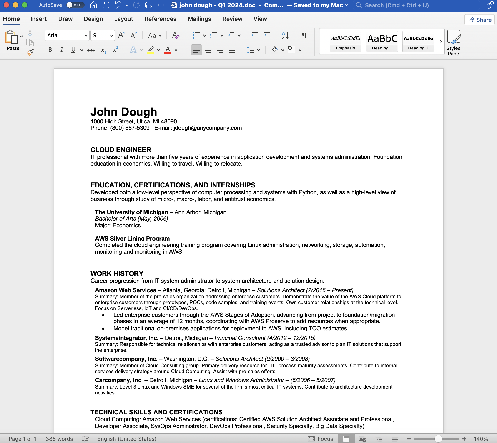

Consider your resume as one part of your portfolio as a technical professional. Your complete portfolio should include:
* Traditional resume and cover letter
* Your GitHub repositories - evidence of what you've done
* Personal website and/or blog, e.g., www.dixonaws.com
  * You can easily develop a personal website with tools like [hugo](http://www.gohugo.io) or [docusaurus](http://www.docusaurus.io) and host in AWS or GitHub
* Your YouTube videos - a starter is your video homework from Silver Lining
* Your LinkedIn profile
* Your personal network

## I've finished the Silver Lining program. What do I add to my resume?
A recommended Silver Lining section looks like this:

EDUCATION and CERTIFICATIONS 
AWS Silver Lining Program
Completed the cloud engineering training program covering Linux administration, networking, storage, automation, monitoring and monitoring in AWS.

Download the example resume of [John Dough](johndough.pdf).

## Resources
Select resume and interview prep resources:
* [Career Tools Resume Guidance Podcast (25:00)](https://www.manager-tools.com/2019/06/resume-update-2019-part-1)
* [The STAR format for interviewing](https://www.themuse.com/advice/star-interview-method)